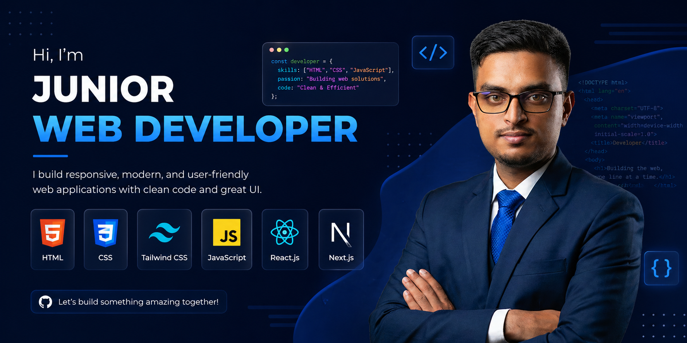

<!-- HEADER BANNER -->

  

<!-- TYPING ANIMATION -->

  

<h1 align="center">Hi 👋, I'm Jubayer Khan Akash</h1>

<h3 align="center">
A Passionate Full Stack Web Developer from Bangladesh 🇧🇩
</h3>

I specialize in building modern, responsive, and scalable web applications using the MERN stack. I enjoy solving real-world problems through clean code, intuitive user interfaces, and efficient backend architecture. I'm continuously learning new technologies and striving to improve as a developer.

---

## 🚀 Current Focus

- 🌱 Learning advanced **Next.js** concepts and best practices
- 💻 Building modern **Full Stack MERN** applications
- ⚡ Exploring performance optimization and scalable architecture
- 📚 Continuously improving frontend and backend development skills

---

# 💻 Tech Stack

### 🎨 Frontend

  

### ⚙️ Backend

  

### 🛠 Tools & Platforms

  

---

# 🚀 Featured Projects

<table>
<tr>

<td width="33%" valign="top">

### 🛍️ NexliGadget Store

A modern full-stack e-commerce platform for gadgets with secure authentication, responsive design, and a seamless shopping experience.

**Tech Stack**

React • Node.js • Express.js • MongoDB • Tailwind CSS

🔗 **Live Demo**

https://nexligadget-store.vercel.app

</td>

<td width="33%" valign="top">

### 💪 FitNova

A complete fitness and gym management platform featuring trainer dashboards, class booking, community interaction, secure authentication, and payment integration.

**Tech Stack**

Next.js • Node.js • Express.js • MongoDB • Tailwind CSS

🔗 **Live Demo**

https://fitnova-org.vercel.app

</td>

<td width="33%" valign="top">

### 🌐 Dev Jubayer

My personal portfolio website showcasing my projects, technical skills, and development journey with a modern and responsive design.

**Tech Stack**

Next.js • Tailwind CSS • Framer Motion

🔗 **Live Demo**

https://dev-jubayer.vercel.app

</td>

</tr>
</table>

---

# 🎯 Goals for 2026

- 🚀 Become an expert MERN Stack Developer
- 📚 Master advanced Next.js and backend architecture
- 💼 Build scalable SaaS and enterprise-level applications
- 🌍 Contribute to Open Source projects
- 🤝 Collaborate with developers worldwide

---

# 🌐 Connect With Me

---

# 💡 Fun Fact

> I enjoy turning ideas into fast, scalable, and user-friendly web applications while continuously learning new technologies.

---

### ⭐ Thanks for visiting my profile!

If you like my work, consider ⭐ starring my repositories and connecting with me.

